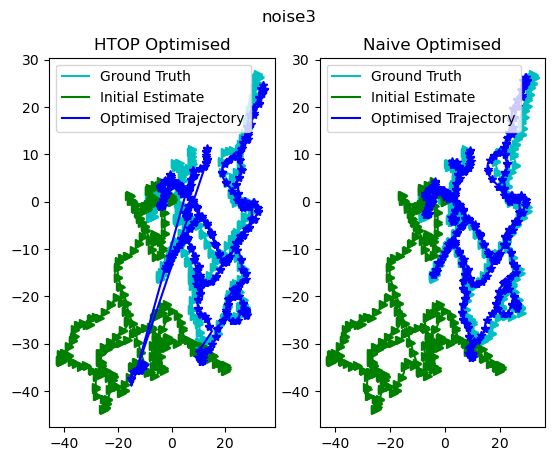
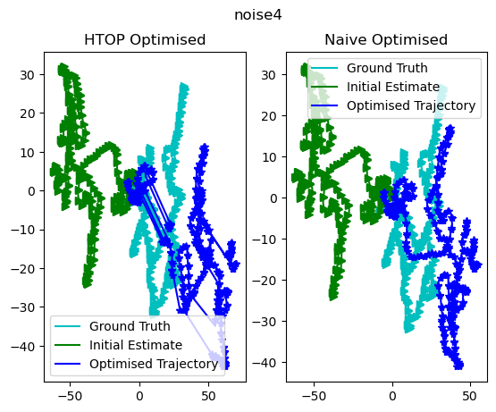

# Hierarchical Topological Optimization for Pose Graphs

Please find the full report [here](https://saishubodh.notion.site/Hierarchical-Topological-Optimization-Project-Report-493210c7b9b543d2af89252585fd159d?pvs=4).

This is an approach on hierarchical approach for the problem of graph-based Simultaneous Localization And Mapping (SLAM) where hierarchies are contructed through semantics of a place. Assuming hierarchical representations of indoor environments (e.g., places, rooms, buildings etc) are known, say Level 0 is actual "pose graph", Level 1 is "Places", Level 2 is "Rooms" and Level 3 is "Buildings", we propose an approach that starts optimization at loop closure "Place". The optimization initially happens at the lowest level of "pose graph" and moves outwards from these regions towards neighbouring "Places". As it moves outwards towards the neighbouring regions, it sparsifies the optimization process and corrects the trajectory sparsely at higher levels, such as "Place graph" or "Room graph" or "Building graph" as it is necessary.

